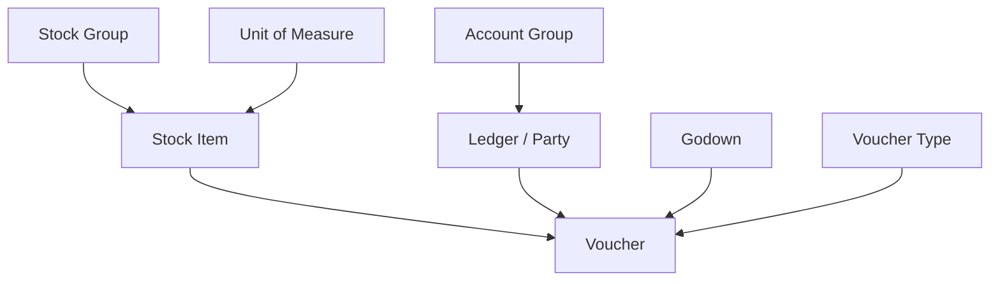
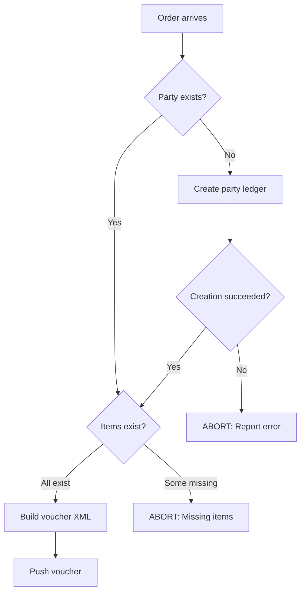

When a sales rep visits a new medical shop and places an order, that party ledger won't exist in Tally yet. You could reject the order and ask someone to manually create the ledger in Tally. Or you could auto-create it.

Auto-creation is the better UX -- but it comes with strict rules.

## The Dependency Chain

Tally masters have dependencies. You can't create a Stock Item without first having its Stock Group and Unit of Measure. You can't create a Ledger without its parent Account Group.

Here's the creation order. **Every step is a separate XML import request.** You must wait for a success response before moving to the next step.



| Step | Master Type | Depends On |
|---|---|---|
| 1 | Stock Group | Nothing (or parent group) |
| 2 | Unit of Measure | Nothing |
| 3 | Stock Item | Stock Group + UoM |
| 4 | Account Group | Nothing (or parent group) |
| 5 | Ledger (Party) | Account Group |
| 6 | Godown | Nothing |
| 7 | Voucher Type | Nothing (or parent type) |
| 8 | Voucher | Everything above |

:::danger
Failure at **any** step aborts the entire chain. Do NOT attempt to create the voucher if any prerequisite master creation failed. You'll get cryptic errors that are nearly impossible to debug.
:::

## Creating a Party Ledger

This is the most common auto-creation scenario. A new medical shop needs a ledger under "Sundry Debtors."

```xml
<ENVELOPE>
 <HEADER>
  <VERSION>1</VERSION>
  <TALLYREQUEST>Import</TALLYREQUEST>
  <TYPE>Data</TYPE>
  <ID>All Masters</ID>
 </HEADER>
 <BODY>
  <DESC>
   <STATICVARIABLES>
    <SVCURRENTCOMPANY>
      Stockist Pharma Pvt Ltd
    </SVCURRENTCOMPANY>
   </STATICVARIABLES>
  </DESC>
  <DATA>
   <TALLYMESSAGE xmlns:UDF="TallyUDF">
    <LEDGER NAME="New Medical Shop - Surat"
            ACTION="Create">
     <PARENT>Sundry Debtors</PARENT>
     <ISBILLWISEON>Yes</ISBILLWISEON>
     <AFFECTSSTOCK>No</AFFECTSSTOCK>
     <ISREVENUE>No</ISREVENUE>
     <ADDRESS.LIST TYPE="String">
      <ADDRESS>123 Main Road</ADDRESS>
      <ADDRESS>Surat, Gujarat 395001</ADDRESS>
     </ADDRESS.LIST>
     <LEDGERPHONE>
       +91-9876543210
     </LEDGERPHONE>
     <LEDGEREMAIL>
       shop@email.com
     </LEDGEREMAIL>
     <LEDSTATENAME>Gujarat</LEDSTATENAME>
     <PARTYGSTIN>
       24ABCDE1234F1Z5
     </PARTYGSTIN>
     <GSTREGISTRATIONTYPE>
       Regular
     </GSTREGISTRATIONTYPE>
    </LEDGER>
   </TALLYMESSAGE>
  </DATA>
 </BODY>
</ENVELOPE>
```

### Key Fields Explained

| Field | Required | Notes |
|---|---|---|
| `NAME` | Yes | Exact ledger name (becomes the key) |
| `PARENT` | Yes | Usually `Sundry Debtors` for customers |
| `ISBILLWISEON` | Recommended | Enables bill-by-bill tracking |
| `LEDSTATENAME` | For GST | State name for GST place of supply |
| `PARTYGSTIN` | If registered | 15-char GSTIN |
| `GSTREGISTRATIONTYPE` | For GST | `Regular`, `Unregistered`, `Composition` |

:::tip
For unregistered medical shops (no GSTIN), set `GSTREGISTRATIONTYPE` to `Unregistered` and omit `PARTYGSTIN`. Tally handles the tax implications automatically.
:::

## Creating a Stock Group

If you need a new product category:

```xml
<STOCKGROUP NAME="Cardiac"
            ACTION="Create">
  <PARENT>Primary</PARENT>
</STOCKGROUP>
```

`Primary` is Tally's root stock group. Most pharma stockists organize by therapeutic category (Analgesics, Antibiotics, Cardiac, etc.).

## Creating a Unit of Measure

```xml
<UNIT NAME="Strip" ACTION="Create">
  <ISSIMPLEUNIT>Yes</ISSIMPLEUNIT>
  <BASEUNITS>Strip</BASEUNITS>
</UNIT>
```

For compound units (like "Box of 10 Strips"):

```xml
<UNIT NAME="Box of 10 Strip"
      ACTION="Create">
  <ISSIMPLEUNIT>No</ISSIMPLEUNIT>
  <BASEUNITS>Strip</BASEUNITS>
  <ADDITIONALUNITS>Box</ADDITIONALUNITS>
  <CONVERSION>10</CONVERSION>
</UNIT>
```

## Creating a Stock Item

```xml
<STOCKITEM NAME="New Medicine 500mg Tab"
           ACTION="Create">
  <PARENT>Analgesics</PARENT>
  <BASEUNITS>Strip</BASEUNITS>
  <GSTAPPLICABLE>Applicable</GSTAPPLICABLE>
  <GSTDETAILS.LIST>
    <APPLICABLEFROM>20170701</APPLICABLEFROM>
    <HSNCODE>30049099</HSNCODE>
    <TAXABILITY>Taxable</TAXABILITY>
    <STATEWISEDETAILS.LIST>
      <STATENAME>Gujarat</STATENAME>
      <RATEDETAILS.LIST>
        <GSTRATE>18</GSTRATE>
      </RATEDETAILS.LIST>
    </STATEWISEDETAILS.LIST>
  </GSTDETAILS.LIST>
</STOCKITEM>
```

:::caution
Auto-creating stock items is riskier than creating party ledgers. Stock items have HSN codes, GST rates, and unit configurations that need to be accurate. We recommend only auto-creating party ledgers and requiring stock items to be set up manually in Tally.
:::

## The Auto-Creation Workflow



## Response Handling for Master Creation

The response format is the same as for vouchers:

```xml
<RESPONSE>
  <CREATED>1</CREATED>
  <ALTERED>0</ALTERED>
  <LASTMASTERID>67890</LASTMASTERID>
  <ERRORS>0</ERRORS>
  <LINEERROR></LINEERROR>
</RESPONSE>
```

**Check `CREATED=1`** before proceeding. If `ERRORS > 0`, read `LINEERROR` for details.

Common creation errors:

| Error | Cause | Fix |
|---|---|---|
| `Duplicate` | Ledger name already exists | Re-fetch masters, use existing |
| `Group not found` | Parent group doesn't exist | Create the group first |
| `Invalid GSTIN` | GSTIN format is wrong | Validate before sending |

## One Master Per Request

:::caution
Don't mix master types in a single TALLYMESSAGE. Ledger creation and Stock Item creation should be separate HTTP requests. Tally processes them differently and mixing can cause unpredictable results.
:::

## Idempotency

What if you send a ledger creation request and the connection drops before you get the response? Did it get created or not?

**Strategy**: Before retrying, query Tally for the ledger:

```xml
<ENVELOPE>
 <HEADER>
  <VERSION>1</VERSION>
  <TALLYREQUEST>Export</TALLYREQUEST>
  <TYPE>Collection</TYPE>
  <ID>LedgerCheck</ID>
 </HEADER>
 <BODY><DESC>
  <STATICVARIABLES>
   <SVCURRENTCOMPANY>
     Stockist Pharma Pvt Ltd
   </SVCURRENTCOMPANY>
  </STATICVARIABLES>
  <TDL><TDLMESSAGE>
   <COLLECTION NAME="LedgerCheck"
               ISMODIFY="No">
    <TYPE>Ledger</TYPE>
    <NATIVEMETHOD>Name, GUID</NATIVEMETHOD>
    <FILTER>NameMatch</FILTER>
   </COLLECTION>
   <SYSTEM TYPE="Formulae"
           NAME="NameMatch">
     $Name = "New Medical Shop - Surat"
   </SYSTEM>
  </TDLMESSAGE></TDL>
 </DESC></BODY>
</ENVELOPE>
```

If the ledger exists, skip creation and proceed to voucher push.
