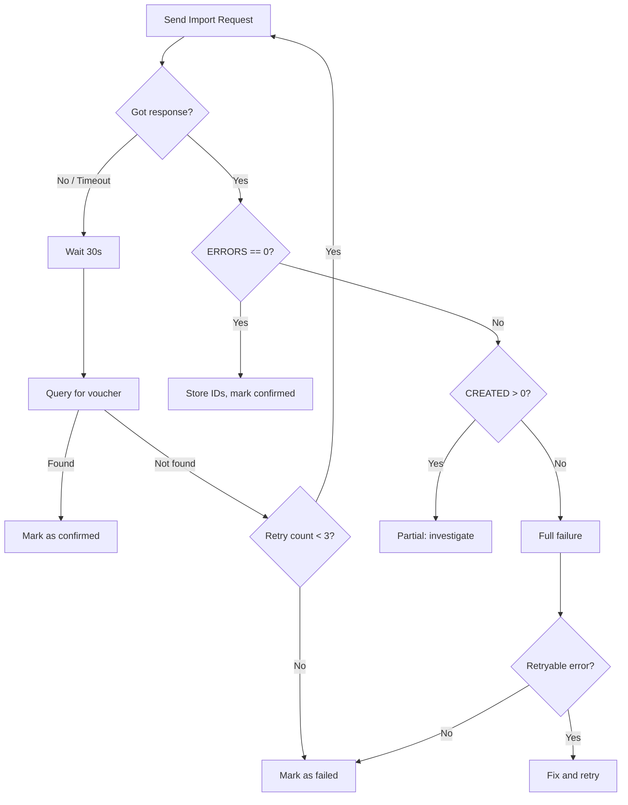

You've built your XML, validated everything, and POSTed it to Tally. Now you need to figure out what Tally thought of your handiwork.

## The Response Structure

Every import request gets a response in this format:

```xml
<RESPONSE>
  <CREATED>1</CREATED>
  <ALTERED>0</ALTERED>
  <COMBINED>0</COMBINED>
  <IGNORED>0</IGNORED>
  <ERRORS>0</ERRORS>
  <LASTVCHID>12345</LASTVCHID>
  <LASTMASTERID>67890</LASTMASTERID>
  <LINEERROR></LINEERROR>
</RESPONSE>
```

### Field-by-Field Breakdown

| Field | Meaning |
|---|---|
| `CREATED` | Number of new records created |
| `ALTERED` | Number of existing records modified |
| `COMBINED` | Records merged with existing |
| `IGNORED` | Records skipped (duplicates, etc.) |
| `ERRORS` | Number of records that failed |
| `LASTVCHID` | Internal ID of last voucher created |
| `LASTMASTERID` | Internal ID of last master created |
| `LINEERROR` | Error details (can be multi-line) |

:::tip
`LASTVCHID` and `LASTMASTERID` are your golden tickets. Store them immediately. You'll need them for alter/cancel/delete operations and for cross-referencing with Tally's internal data.
:::

## Success Patterns

### Clean Success (Single Voucher)

```xml
<RESPONSE>
  <CREATED>1</CREATED>
  <ALTERED>0</ALTERED>
  <COMBINED>0</COMBINED>
  <IGNORED>0</IGNORED>
  <ERRORS>0</ERRORS>
  <LASTVCHID>12345</LASTVCHID>
  <LASTMASTERID>0</LASTMASTERID>
  <LINEERROR></LINEERROR>
</RESPONSE>
```

**Check**: `CREATED >= 1` and `ERRORS == 0`.

### Clean Success (Master Record)

```xml
<RESPONSE>
  <CREATED>1</CREATED>
  <ALTERED>0</ALTERED>
  <COMBINED>0</COMBINED>
  <IGNORED>0</IGNORED>
  <ERRORS>0</ERRORS>
  <LASTVCHID>0</LASTVCHID>
  <LASTMASTERID>67890</LASTMASTERID>
  <LINEERROR></LINEERROR>
</RESPONSE>
```

For master creation, `LASTMASTERID` is populated instead of `LASTVCHID`.

### Successful Alter

```xml
<RESPONSE>
  <CREATED>0</CREATED>
  <ALTERED>1</ALTERED>
  <COMBINED>0</COMBINED>
  <IGNORED>0</IGNORED>
  <ERRORS>0</ERRORS>
  <LASTVCHID>12345</LASTVCHID>
  <LASTMASTERID>0</LASTMASTERID>
  <LINEERROR></LINEERROR>
</RESPONSE>
```

**Check**: `ALTERED >= 1` and `ERRORS == 0`.

## Failure Patterns

### Full Failure

```xml
<RESPONSE>
  <CREATED>0</CREATED>
  <ALTERED>0</ALTERED>
  <COMBINED>0</COMBINED>
  <IGNORED>0</IGNORED>
  <ERRORS>1</ERRORS>
  <LASTVCHID>0</LASTVCHID>
  <LASTMASTERID>0</LASTMASTERID>
  <LINEERROR>
    Voucher totals do not match!
  </LINEERROR>
</RESPONSE>
```

Nothing got created. The `LINEERROR` tells you why (kind of -- see the error table below).

### Partial Failure (Batch Import)

If you send multiple vouchers in one request:

```xml
<RESPONSE>
  <CREATED>3</CREATED>
  <ALTERED>0</ALTERED>
  <COMBINED>0</COMBINED>
  <IGNORED>0</IGNORED>
  <ERRORS>2</ERRORS>
  <LASTVCHID>12350</LASTVCHID>
  <LASTMASTERID>0</LASTMASTERID>
  <LINEERROR>
    Entry 4: [STOCKITEM] not found
    Entry 5: Voucher totals do not match!
  </LINEERROR>
</RESPONSE>
```

:::danger
Partial failures are the trickiest. Three vouchers succeeded, two failed. You need to figure out **which** three succeeded. Tally doesn't tell you directly -- it only gives you the last created ID. This is why we recommend sending **one voucher per request** for critical operations like Sales Orders.
:::

## Common Error Messages

| Error Message | Cause | Connector Action |
|---|---|---|
| `Voucher totals do not match!` | Dr/Cr don't balance | Fix rounding, re-push |
| `[STOCKITEM] not found` | Item name mismatch | Check cached items, re-validate |
| `[LEDGER] not found` | Ledger doesn't exist | Auto-create ledger, retry |
| `Unknown Request` | Malformed XML or too large | Check XML, split batch |
| `Duplicate Voucher Number` | Number already exists | Use different prefix/number |

### The Timeout Non-Response

Sometimes you get nothing. No response at all. The HTTP connection times out.

**Causes**:
- Tally is processing and it's taking too long
- Tally froze (common with large batches)
- Network interruption

**Strategy**: Wait, then check. Query Tally for the voucher number to see if it was created before retrying.

## Parsing Strategy (Go)

```go
type TallyResponse struct {
    Created      int    `xml:"CREATED"`
    Altered      int    `xml:"ALTERED"`
    Combined     int    `xml:"COMBINED"`
    Ignored      int    `xml:"IGNORED"`
    Errors       int    `xml:"ERRORS"`
    LastVchID    int    `xml:"LASTVCHID"`
    LastMasterID int    `xml:"LASTMASTERID"`
    LineError    string `xml:"LINEERROR"`
}

func parseResponse(
    body []byte,
) (*TallyResponse, error) {
    var resp TallyResponse
    err := xml.Unmarshal(body, &resp)
    if err != nil {
        return nil, fmt.Errorf(
            "parse failed: %w", err,
        )
    }
    return &resp, nil
}
```

## The Error Handling Flowchart



## What to Store After Success

When you get `CREATED=1`, immediately store:

```sql
UPDATE write_orders
SET
  tally_master_id = :lastMasterID,
  tally_voucher_guid = :guid,
  status = 'confirmed',
  response_xml = :rawResponse,
  confirmed_at = CURRENT_TIMESTAMP
WHERE central_order_id = :orderID;
```

:::tip
Also store the raw response XML. When something goes wrong three weeks later and the stockist's CA calls asking "why is this order in Tally?", you'll want the receipt.
:::

## Retryable vs. Non-Retryable Errors

| Error Type | Retryable? | Action |
|---|---|---|
| Timeout / no response | Yes | Retry with backoff |
| `[LEDGER] not found` | Yes | Auto-create, then retry |
| `Voucher totals don't match` | No | Fix calculation, re-push |
| `[STOCKITEM] not found` | No | Notify sales team |
| `Unknown Request` | Maybe | Check XML format first |
| `Duplicate Voucher Number` | No | Generate new number |

## Batch Import Advice

We strongly recommend one voucher per HTTP request for Sales Orders. The reasons:

1. You know exactly which voucher failed
2. You get the correct `LASTVCHID` for each
3. You can retry individual failures
4. The request is smaller and less likely to timeout

For bulk operations (like initial data migration), batching makes sense. But for live order flow, one-at-a-time is safer.
