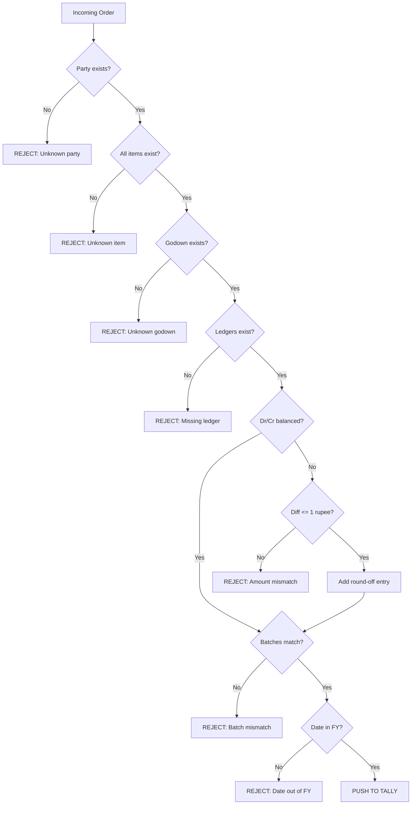

Tally's import error messages are... not great. "Voucher totals do not match!" doesn't tell you which line item is wrong. "[STOCKITEM] not found" doesn't tell you which character is off.

The solution? Validate everything **before** you push. Catch errors locally where you can give useful feedback to the sales team.

## The Pre-Push Checklist

Run every single one of these checks before sending XML to Tally. If any check fails, reject the order immediately and tell the sales app exactly what's wrong.

### 1. Party Ledger Exists

```
Check: Does the party ledger name exist
        in Tally?
Match:  EXACT. Case-sensitive.
```

The party name in your order must match a ledger in Tally character-for-character. "Raj Medical Store" is not "Raj medical store" is not "RAJ MEDICAL STORE".

:::danger
Tally's name matching is **case-sensitive** for import operations. "raj medical" will fail even if "Raj Medical" exists. Always use the exact name from your cached master data.
:::

**If it doesn't exist**: You have two options:
1. Auto-create the ledger first (see [Auto-Create Masters](/tally-integartion/write-back/auto-create-masters/))
2. Reject the order and ask the sales rep to pick from a known list

### 2. Stock Item Names Match Exactly

```
Check: Does every stock item name in the
        order exist in Tally?
Match:  EXACT. Case-sensitive.
```

Your sales app should only allow selection from the cached stock item list pulled from Tally. Free-text item entry is a recipe for import failures.

Common mismatches:

| App Sends | Tally Has | Result |
|---|---|---|
| `Dolo 650` | `Dolo 650 Tab` | FAIL |
| `PARACETAMOL 500MG` | `Paracetamol 500mg Strip/10` | FAIL |
| `Amoxicillin` | `Amoxicillin 250mg Cap/10` | FAIL |

### 3. Godown Exists

```
Check: Does the godown name exist in Tally?
Match:  EXACT.
```

If multi-godown is enabled, every batch allocation needs a valid godown name. Most stockists use "Main Location" (Tally's default), but some have multiple:

- Main Location
- Cold Storage
- Counter
- Damaged Stock

:::tip
If you're not sure whether multi-godown is enabled, check the company profile. When it's disabled, you can omit `GODOWNNAME` entirely -- Tally assumes the default.
:::

### 4. Sales Ledger Exists

```
Check: Does the accounting allocation
        ledger exist?
Match:  EXACT.
```

Your XML references ledgers like "Sales Account" in the accounting allocations. This ledger must exist. Common variations:

- `Sales Account`
- `Sales A/c`
- `Sales`
- `Sales - Local`
- `Sales - Interstate`

### 5. GST/Tax Ledgers Exist

```
Check: Do all tax ledger names exist
        in Tally?
Match:  EXACT.
```

Tax ledger names vary by stockist. Common patterns:

| Intra-state (CGST+SGST) | Inter-state (IGST) |
|---|---|
| `Output CGST 9%` | `Output IGST 18%` |
| `Output SGST 9%` | `Output IGST 12%` |
| `CGST 9%` | `IGST 18%` |
| `Output CGST` | `Output IGST` |

:::caution
Don't hardcode tax ledger names. Fetch them from Tally during the profile phase and map them in your configuration.
:::

### 6. Dr/Cr Totals Balance

```
Check: Sum of all AMOUNT fields = 0.00
Tolerance: ZERO. Must balance to the paisa.
```

This is the most common cause of import failure. Here's the math:

```
Party amount (debit, negative)
+ Sales amount (credit, positive)
+ Tax amount(s) (credit, positive)
= 0.00
```

If your app calculates GST at 18% on Rs 10,000 and gets Rs 1,800.00, but Tally's ledger expects the tax on individual line items (which might round differently), you'll get a mismatch.

See [Round-Off Handling](/tally-integartion/write-back/round-off-handling/) for the fix.

### 7. Batch Allocations Match Quantities

```
Check: Sum of batch quantities = line item
        quantity for each stock item
```

If a line item says `ACTUALQTY = 100 Strip`, the batch allocations for that item must also total 100 Strip. Common mistake: forgetting to add batch allocations when batches are enabled.

### 8. Date Falls Within Company FY

```
Check: Voucher date is within the active
        financial year
```

Tally won't accept vouchers dated outside the currently active financial year. If the company's FY is April 2025 to March 2026, a voucher dated `20260401` (April 1, 2026) will fail unless the new FY has been opened.

## The Validation Pipeline

Run these checks in order. Stop at the first failure.



## What Happens When Validation Fails

Don't just log the error and move on. Feed it back to the sales team immediately.

### Error Response to Sales App

```json
{
  "order_id": "ORD-0042",
  "status": "rejected",
  "errors": [
    {
      "code": "ITEM_NOT_FOUND",
      "field": "line_items[1].name",
      "message": "Stock item 'Dolo 650' not found. Did you mean 'Dolo 650 Tab 15s'?",
      "suggestions": [
        "Dolo 650 Tab 15s",
        "Dolo 650 Tab 10s"
      ]
    }
  ]
}
```

:::tip
Fuzzy matching on the error side is a great UX touch. When a stock item name doesn't match, suggest the closest matches from your cached master list. The sales rep can pick the right one and resubmit in seconds.
:::

## Keeping Validation Data Fresh

Your validation checks only work if your cached master data is current. Here's the refresh strategy:

| Data | Refresh Frequency | Why |
|---|---|---|
| Party ledgers | Every 5 minutes | New shops get added |
| Stock items | Every 5 minutes | Items get renamed |
| Godowns | Every hour | Rarely change |
| Tax ledgers | Every hour | Almost never change |
| Company FY dates | On startup + daily | Changes once a year |

## The "Auto-Create or Reject" Decision

For party ledgers, you have a choice: auto-create missing parties or reject the order. Here's a decision framework:

**Auto-create when**:
- The sales app collects enough party info (name, address, GSTIN)
- Your config has `auto_create_ledgers = true`
- The party is clearly a new customer, not a typo

**Reject when**:
- The party name looks like a typo of an existing party
- The sales app didn't collect required fields
- You want human review before adding parties to Tally

See [Auto-Create Masters](/tally-integartion/write-back/auto-create-masters/) for the full auto-creation workflow.
