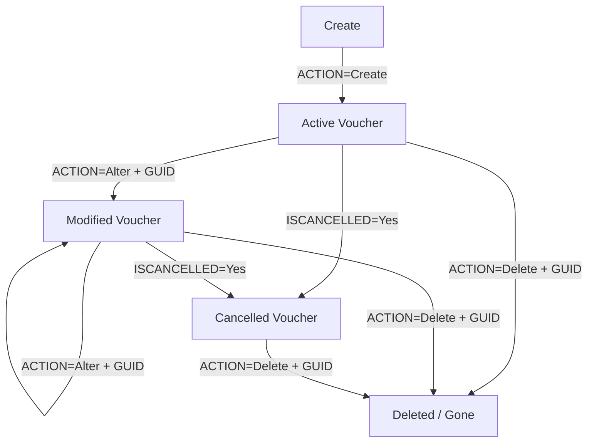
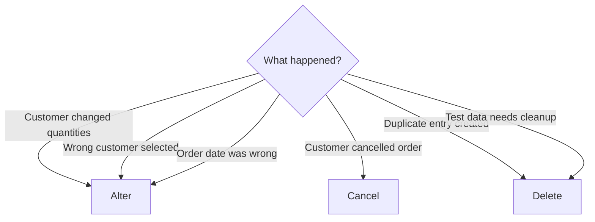

A voucher in Tally isn't a fire-and-forget thing. After creation, it can be modified, cancelled, or deleted. Each operation has different semantics, and picking the wrong one can cause real headaches.

## The Four Operations



## Create: ACTION="Create"

This is the starting point. You've already seen this in the [Sales Order XML](/tally-integartion/write-back/sales-order-xml/) page.

```xml
<VOUCHER VCHTYPE="Sales Order"
         ACTION="Create"
         OBJVIEW="Invoice Voucher View">
  <!-- full voucher body -->
</VOUCHER>
```

**When to use**: A new field order comes in and needs to appear in Tally for the first time.

**What happens**: Tally assigns a MasterID and GUID. The response includes `LASTVCHID` -- store this. You'll need it for every subsequent operation.

## Alter: ACTION="Alter"

The customer calls back: "Make that 80 strips instead of 100." You need to modify the existing voucher.

```xml
<VOUCHER VCHTYPE="Sales Order"
         ACTION="Alter"
         OBJVIEW="Invoice Voucher View">
  <GUID>
    a1b2c3d4-e5f6-7890-abcd-ef0123456789
  </GUID>
  <DATE>20260325</DATE>
  <VOUCHERTYPENAME>
    Sales Order
  </VOUCHERTYPENAME>
  <VOUCHERNUMBER>SO/FIELD/0042</VOUCHERNUMBER>
  <!-- full modified voucher body -->
</VOUCHER>
```

:::caution
When altering, you must send the **complete** voucher -- not just the changed fields. Tally replaces the entire voucher with what you send. If you omit a line item, it's gone.
:::

### Identifying the Voucher

You can identify a voucher for alteration using:

| Method | Reliability | Example |
|---|---|---|
| GUID | Best | `<GUID>a1b2c3...</GUID>` |
| MasterID | Good | `<MASTERID>12345</MASTERID>` |
| Number + Type + Date | Fragile | All three must match |

**Our recommendation**: Always use the GUID. Store it when you get the create response. GUIDs are globally unique and never change.

### Alter vs. Re-Create

Some teams delete the old voucher and create a new one instead of altering. This works but has downsides:

- You get a new GUID and MasterID
- Any Delivery Notes linked to the original order lose their reference
- Audit trail shows a deletion + creation instead of a clean modification

Alter is almost always the right choice.

## Cancel: ISCANCELLED = Yes

Cancellation is a soft-delete. The voucher stays in Tally but is marked as cancelled. It shows up in reports with a "Cancelled" flag and doesn't affect stock or accounting.

```xml
<VOUCHER VCHTYPE="Sales Order"
         ACTION="Alter"
         OBJVIEW="Invoice Voucher View">
  <GUID>
    a1b2c3d4-e5f6-7890-abcd-ef0123456789
  </GUID>
  <DATE>20260325</DATE>
  <VOUCHERTYPENAME>
    Sales Order
  </VOUCHERTYPENAME>
  <VOUCHERNUMBER>SO/FIELD/0042</VOUCHERNUMBER>
  <ISCANCELLED>Yes</ISCANCELLED>
  <!-- rest of voucher body -->
</VOUCHER>
```

**When to use**: The medical shop changed their mind, but you want to keep a record. This is the most common operation after "create."

**What happens**:
- The voucher remains visible in Tally's daybook
- It's flagged with `ISCANCELLED=Yes`
- It doesn't count toward outstanding orders
- The warehouse sees it as cancelled

:::tip
Cancellation is preferred over deletion for audit compliance. Indian tax rules often require you to keep records of cancelled transactions. When in doubt, cancel -- don't delete.
:::

## Delete: ACTION="Delete"

Nuclear option. The voucher is gone. No trace in reports (though Tally's internal log may still reference it).

```xml
<VOUCHER VCHTYPE="Sales Order"
         ACTION="Delete">
  <GUID>
    a1b2c3d4-e5f6-7890-abcd-ef0123456789
  </GUID>
</VOUCHER>
```

**When to use**: Test data cleanup. Duplicate entries. Cases where the voucher should never have existed.

:::danger
Deleted vouchers cannot be recovered via the API. The stockist would need to restore from a Tally backup. Use deletion only when you're absolutely sure.
:::

**What happens**:
- The voucher is removed from all reports
- The GUID becomes invalid
- Any linked Delivery Notes or Invoices may break

## Decision Flowchart



## Lifecycle States in Your Database

Track the voucher state in your local database:

```sql
-- Possible status values
-- pending   : order queued, not yet pushed
-- pushed    : sent to Tally, awaiting confirm
-- confirmed : create response received OK
-- altered   : successfully modified
-- cancelled : successfully cancelled
-- failed    : push failed (check error)
-- deleted   : removed from Tally
```

## Response Handling Per Operation

| Operation | Success Indicator | Key Response Fields |
|---|---|---|
| Create | `CREATED=1` | `LASTVCHID`, `LASTMASTERID` |
| Alter | `ALTERED=1` | Same GUID preserved |
| Cancel | `ALTERED=1` | Treated as alter internally |
| Delete | `DELETED=1` | GUID now invalid |

See [Import Response](/tally-integartion/write-back/import-response/) for full details on parsing these responses.

## Common Pitfalls

**Altering a partially fulfilled order**: If the warehouse has already dispatched 60 of 100 strips, and you alter the order to 50 strips, Tally won't stop you -- but the outstanding report will show -10 strips. Validate against fulfilment status before altering.

**Cancelling a fully fulfilled order**: Tally allows it, but it creates accounting confusion. The Delivery Notes and Invoices still exist. Only cancel orders that haven't been fulfilled.

**Deleting while someone is viewing**: If the Tally operator has the voucher open when you delete it, they'll get an error on save. Time your operations for off-hours when possible.
