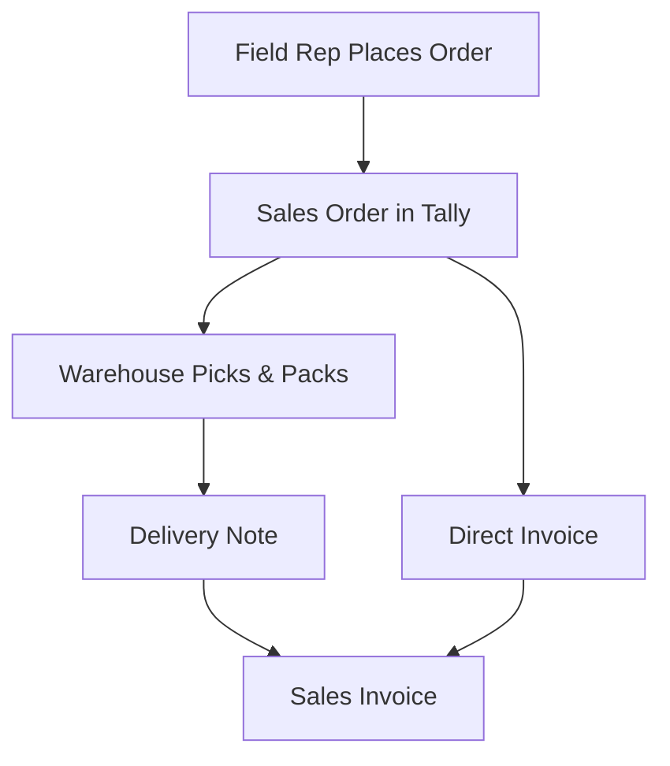
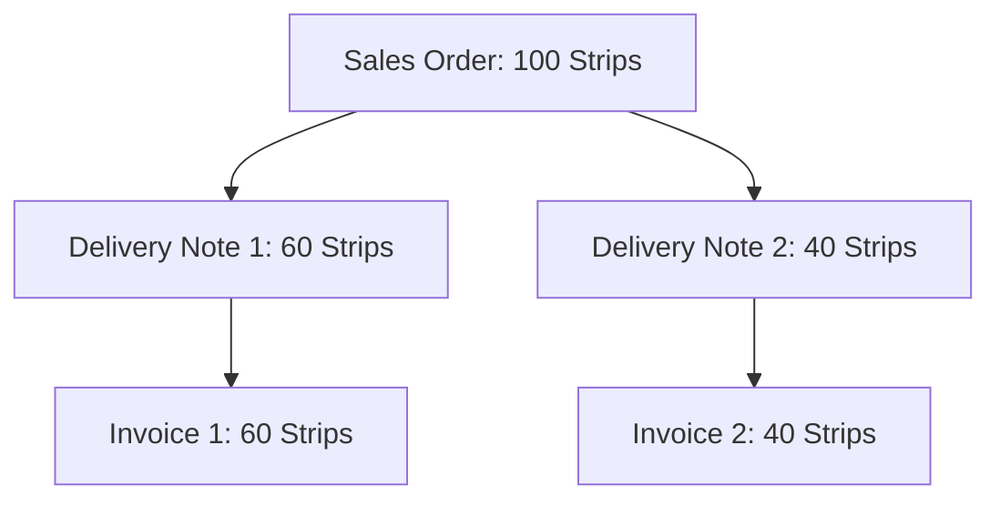

Write-back isn't something you bolt on later. It's the very first thing that needs to work. Here's why.

## The Warehouse Has No Eyes

Picture this: your field sales rep visits a medical shop in Ahmedabad. They check what's needed, negotiate quantities, and place an order on their phone. Great.

Now what?

If that order doesn't land in Tally as a Sales Order, the stockist's warehouse team has **zero visibility** of what to prepare. They don't know what to pick. They don't know what to pack. The entire fulfilment chain is broken before it starts.

:::danger
Without write-back, the connector is a read-only dashboard. Useful? Maybe. But it doesn't move boxes off shelves.
:::

## The Fulfilment Chain

Every order follows a strict sequence in Tally. Skip a step, and the accounting falls apart.

Let's break that down:

### 1. Sales Order (Ctrl+F8)

This is a **commitment**, not a transaction. It doesn't move stock. It doesn't hit the accounts. But it shows up in:

- **Sales Order Outstanding** report
- **Stock Summary** as "on order" quantity
- The warehouse manager's daily work queue

### 2. Delivery Note (Alt+F8)

Stock physically leaves the godown. Tally records the stock movement but doesn't create an accounting entry yet.

### 3. Sales Invoice (F8)

The real deal. Stock goes out **and** the accounting entries fire: debit the party ledger, credit the sales ledger, credit the tax ledgers.

:::tip
For simple operations, you can skip the Delivery Note and go straight from Sales Order to Sales Invoice. But most pharma stockists use the full three-step flow because they need to track what left the warehouse vs. what got billed.
:::

## Why Not Defer to Phase 2?

We've seen integration projects that build read-only sync first and "plan to add write-back later." Here's what happens:

1. The sales team gets a shiny app that shows stock levels
2. They still have to call the warehouse to place orders
3. The warehouse still enters orders manually into Tally
4. Nobody uses the app after the first week

The field sales rep needs to tap "Place Order" and have it appear in Tally within minutes. That's the value proposition. Everything else is supporting infrastructure.

## What Write-Back Actually Means

At its core, write-back is an HTTP POST to Tally containing XML that creates a Sales Order voucher. But getting that POST right involves:

| Step | What Happens |
|---|---|
| Pre-validation | Verify party, items, and ledgers exist |
| XML construction | Build a balanced voucher with correct entries |
| Import | POST to Tally's HTTP server |
| Response parsing | Confirm creation, capture GUID |

Each of these steps has its own page in this guide. But the key insight is this: **write-back is foundational, not deferred.**

## The Partial Fulfilment Wrinkle

A Sales Order can be fulfilled across multiple Delivery Notes and Invoices. The warehouse might ship 60 strips today and 40 strips tomorrow against a 100-strip order.

Tally tracks this automatically. The Sales Order Outstanding report shows what's still pending. Your connector doesn't need to manage fulfilment state -- just push the order and let Tally do what Tally does best.

## Next Steps

Ready to build the actual XML? Head to [Sales Order XML](/tally-integartion/write-back/sales-order-xml/) for the complete template and line-by-line walkthrough.
