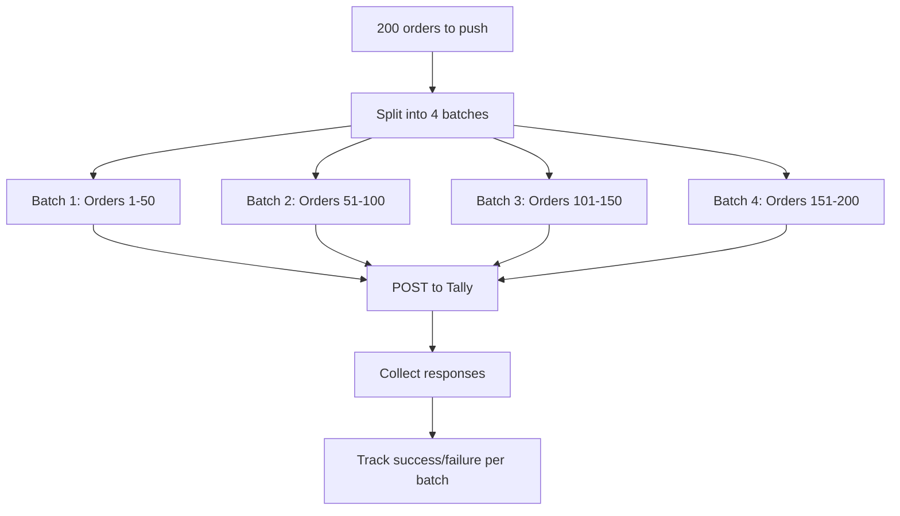
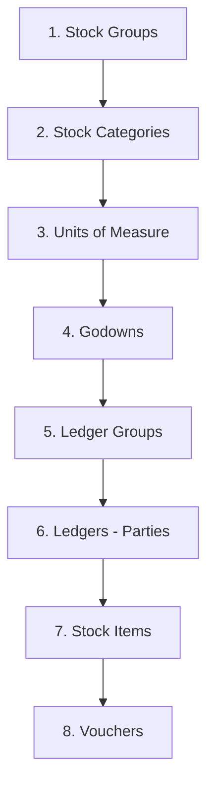
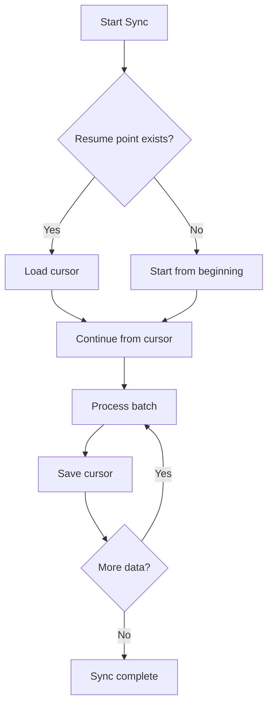

Tally is a desktop application. It runs on a single Windows machine, shares resources with the user clicking around in it, and was not designed to be a high-throughput API server. Treat it gently, and it will happily serve your integration. Push too hard, and it will freeze — blocking the stockist from doing their work.

This page covers the hard-won rules for keeping Tally responsive while syncing large datasets.

## The Golden Rules

Three numbers to memorize:

| Limit | Value | What Happens If Exceeded |
|-------|-------|-------------------------|
| Import batch size | ~50 vouchers per `TALLYMESSAGE` | `Unknown Request` error or Tally freeze |
| Export collection size | ~5,000 objects per request | Tally freezes, RAM spikes, eventual timeout |
| Voucher date batching | 1 day per request (for large companies) | Memory exhaustion, multi-minute freezes |

These are not official Tally limits — they are practical limits discovered by the community (tally-database-loader, API2Books, and others) through painful experience.

:::danger
Exceeding these limits does not produce a clean error. Tally may freeze entirely — locking out the human operator until it recovers or is force-killed. Your connector should never put a stockist in that position.
:::

## Import Batching (~50 Vouchers Max)

When pushing vouchers into Tally via Import/Data, keep each `TALLYMESSAGE` to roughly 50 vouchers or fewer.

### Why 50?

Tally processes the entire `TALLYMESSAGE` as a single transaction. The more vouchers in the batch, the more RAM and processing time required. Beyond ~50, some Tally instances start returning `Unknown Request` instead of processing the data.

### How to Batch Imports



In pseudocode:

```
BATCH_SIZE = 50
batches = chunk(vouchers, BATCH_SIZE)

for batch in batches:
    xml = buildTallyMessage(batch)
    resp = httpPost(tallyURL, xml)
    trackResult(batch, resp)
    // small pause between batches
    sleep(500ms)
```

:::tip
Add a small delay (500ms-1s) between batches. This gives Tally breathing room and prevents the user from seeing performance degradation.
:::

### One Master Type Per Request

When importing masters, do not mix types in the same `TALLYMESSAGE`:

```xml
<!-- GOOD: one type per message -->
<TALLYMESSAGE>
  <LEDGER NAME="Shop A" ACTION="Create">
    ...
  </LEDGER>
  <LEDGER NAME="Shop B" ACTION="Create">
    ...
  </LEDGER>
</TALLYMESSAGE>
```

```xml
<!-- BAD: mixed types -->
<TALLYMESSAGE>
  <LEDGER NAME="Shop A" ACTION="Create">
    ...
  </LEDGER>
  <STOCKITEM NAME="Item X" ACTION="Create">
    ...
  </STOCKITEM>
</TALLYMESSAGE>
```

## Export Batching (~5,000 Objects Max)

When pulling collections, cap at around 5,000 objects per request.

### What Counts as an Object?

Each top-level element in the collection response is one object. So 5,000 stock items, or 5,000 ledgers, or 5,000 vouchers — each is the limit for a single request.

### Strategies for Large Collections

**For masters** (stock items, ledgers): Most companies have fewer than 5,000 stock items. If they do have more, paginate using AlterID:

```xml
<!-- First batch: AlterId 0-5000 -->
<FILTER>Batch1</FILTER>
...
<SYSTEM TYPE="Formulae" NAME="Batch1">
  $$FilterBetween:$AlterId:0:5000
</SYSTEM>

<!-- Second batch: AlterId 5001-10000 -->
<FILTER>Batch2</FILTER>
...
<SYSTEM TYPE="Formulae" NAME="Batch2">
  $$FilterBetween:$AlterId:5001:10000
</SYSTEM>
```

**For vouchers**: Use day-by-day date batching (see below).

## Day-by-Day Batching for Vouchers

Large companies can have hundreds or thousands of vouchers per day during busy periods. For these companies, set `SVFROMDATE` and `SVTODATE` to the same day and iterate:

```
for each day in date_range:
    SVFROMDATE = day
    SVTODATE   = day
    pull vouchers for that day
    store in cache
```

### When to Use Day-by-Day

| Company Size | Vouchers/Month | Batch Strategy |
|-------------|---------------|----------------|
| Small | < 500 | Monthly or single pull |
| Medium | 500-5,000 | Monthly batches |
| Large | 5,000-50,000 | Daily batches |
| Very large | 50,000+ | Daily + subdivide by voucher type |

:::caution
For the initial full sync of a large company with years of history, day-by-day batching is **mandatory**. Pulling 5+ years of vouchers in one request will freeze Tally indefinitely. The tally-database-loader project explicitly warns about this.
:::

## Dependency Ordering

When importing data, order matters. Masters must exist before vouchers that reference them.

### The Correct Import Order



If you try to import a Sales Order that references a ledger that does not exist, Tally will reject it with `[LEDGER] not found`. Same for stock items, godowns, and other master references.

### Practical Import Sequence

1. **Stock Groups** — the hierarchy for organizing items
2. **Stock Categories** — optional categorization
3. **Units of Measure** — pcs, kg, strip, box
4. **Godowns** — warehouse locations
5. **Ledgers** — party accounts (customers, suppliers), sales accounts, tax accounts
6. **Stock Items** — the actual inventory items
7. **Vouchers** — transactions referencing all of the above

:::tip
For day-to-day operations, you usually only need steps 5-7. Stock groups, categories, units, and godowns rarely change. Import them once and only re-sync when your change detection says they have been modified.
:::

## Progress Reporting and Resumability

A full sync of a large company can take hours. Your connector needs to be resilient to interruptions.

### Track Progress per Entity Type

Store a sync cursor for each entity and batch:

```
sync_state:
  masters:
    stock_items:  { last_alter_id: 5000 }
    ledgers:      { last_alter_id: 3200 }
  vouchers:
    last_date_synced: "2026-03-15"
    last_alter_id:    12000
```

If the connector restarts mid-sync, it picks up from the last successful cursor position instead of starting over.

### Resumability Pattern



### Reporting Progress

For long-running syncs, report progress so the operator (or the central system) knows things are alive:

```
[14:30:01] Syncing masters...
[14:30:03]   Stock items: 1,200/1,200 done
[14:30:04]   Ledgers: 800/800 done
[14:30:05] Syncing vouchers...
[14:30:05]   2026-01-01: 45 vouchers
[14:30:06]   2026-01-02: 62 vouchers
[14:30:07]   2026-01-03: 38 vouchers
...
[14:35:12]   2026-03-25: 71 vouchers
[14:35:12] Sync complete: 12,450 vouchers
```

## Performance Reference Table

Based on real-world testing with typical Indian stockist Tally setups:

| Operation | Batch Size | Typical Duration | Notes |
|-----------|-----------|-----------------|-------|
| Export masters (all stock items) | 1,000 items | 2-5 seconds | Fast — small payload |
| Export masters (all ledgers) | 2,000 ledgers | 3-8 seconds | Depends on address data |
| Export vouchers (1 day) | 50-200 vouchers | 1-3 seconds | With full inventory detail |
| Export vouchers (1 month) | 1,000-5,000 | 5-30 seconds | Depends on line items per voucher |
| Import vouchers (50 batch) | 50 vouchers | 3-10 seconds | Validation adds time |
| Import masters (50 ledgers) | 50 ledgers | 1-3 seconds | Faster than vouchers |
| Function call (AlterID check) | 1 call | < 1 second | Essentially free |

:::caution
These numbers assume Tally is not under heavy human use. During peak data entry hours, response times can double or triple. Schedule large sync operations for off-hours when possible.
:::

## Configuration Example

Here is how batching parameters typically map to configuration:

```toml
[sync]
# Import batching
voucher_import_batch_size = 50
master_import_batch_size = 50
inter_batch_delay_ms = 500

# Export batching
max_collection_size = 5000
voucher_export_strategy = "daily"
# "daily" | "monthly" | "single"

# Full sync
full_sync_on_start = true
full_reconcile_interval = "24h"
```

## Quick Reference

| Rule | Value |
|------|-------|
| Max vouchers per import | ~50 |
| Max objects per export | ~5,000 |
| Voucher export strategy | Day-by-day for large companies |
| Import order | Masters before vouchers |
| Master type mixing | One type per request |
| Inter-batch delay | 500ms-1s |
| Full reconciliation | Every 24 hours |

## What is Next

You now have a complete picture of the XML protocol — all five request types, inline TDL, and batching strategies. Head back to the [Request Types overview](/tally-integartion/xml-protocol/request-types/) to review, or dive into building your connector.
