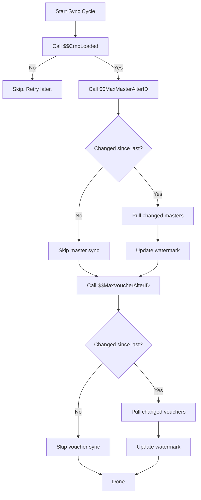

Sometimes you do not need a report or a list of objects. You just need a single answer: *Is a company loaded? What is the latest AlterID? Is Tally even awake?*

That is what Export/Function is for. It evaluates a TDL function and returns the result. Lightweight, fast, perfect for health checks and change detection.

## When to Use Export/Function

- **Heartbeat / health check** — Is Tally running and a company loaded?
- **Change detection** — Has anything changed since my last sync?
- **Quick lookups** — Get a single computed value without pulling an entire collection

## The Basic Template

```xml
<ENVELOPE>
  <HEADER>
    <VERSION>1</VERSION>
    <TALLYREQUEST>Export</TALLYREQUEST>
    <TYPE>Function</TYPE>
    <ID>$$CmpLoaded</ID>
  </HEADER>
  <BODY>
    <DESC>
      <STATICVARIABLES>
        <SVCURRENTCOMPANY>
          Stockist Pharma Pvt Ltd
        </SVCURRENTCOMPANY>
      </STATICVARIABLES>
    </DESC>
  </BODY>
</ENVELOPE>
```

The `ID` is the TDL function to evaluate, prefixed with `$$`. The response is the function's return value.

## The Three Functions You Need

### $$CmpLoaded — Is a Company Loaded?

This is your heartbeat function. Call it before starting a sync cycle to confirm that the target company is loaded and Tally is responsive.

```xml
<HEADER>
  <VERSION>1</VERSION>
  <TALLYREQUEST>Export</TALLYREQUEST>
  <TYPE>Function</TYPE>
  <ID>$$CmpLoaded</ID>
</HEADER>
```

**Response when loaded:**

```xml
<ENVELOPE>
  <BODY>
    <DESC></DESC>
    <DATA>
      <RESULT>Yes</RESULT>
    </DATA>
  </BODY>
</ENVELOPE>
```

**Response when not loaded:**

```xml
<ENVELOPE>
  <BODY>
    <DESC></DESC>
    <DATA>
      <RESULT>No</RESULT>
    </DATA>
  </BODY>
</ENVELOPE>
```

:::tip
Make `$$CmpLoaded` the first call in every sync cycle. If it returns `No` or times out, skip the cycle and retry later. No point hammering Tally with export requests if nobody is home.
:::

### $$MaxMasterAlterID — Master Change Detection

Returns the highest AlterID across all master objects (stock items, ledgers, godowns, etc.) in the current company.

```xml
<ENVELOPE>
  <HEADER>
    <VERSION>1</VERSION>
    <TALLYREQUEST>Export</TALLYREQUEST>
    <TYPE>Function</TYPE>
    <ID>$$MaxMasterAlterID</ID>
  </HEADER>
  <BODY>
    <DESC>
      <STATICVARIABLES>
        <SVCURRENTCOMPANY>
          Stockist Pharma Pvt Ltd
        </SVCURRENTCOMPANY>
      </STATICVARIABLES>
    </DESC>
  </BODY>
</ENVELOPE>
```

**Response:**

```xml
<ENVELOPE>
  <BODY>
    <DESC></DESC>
    <DATA>
      <RESULT>12345</RESULT>
    </DATA>
  </BODY>
</ENVELOPE>
```

### $$MaxVoucherAlterID — Voucher Change Detection

Same idea, but for vouchers (transactions):

```xml
<ENVELOPE>
  <HEADER>
    <VERSION>1</VERSION>
    <TALLYREQUEST>Export</TALLYREQUEST>
    <TYPE>Function</TYPE>
    <ID>$$MaxVoucherAlterID</ID>
  </HEADER>
  <BODY>
    <DESC>
      <STATICVARIABLES>
        <SVCURRENTCOMPANY>
          Stockist Pharma Pvt Ltd
        </SVCURRENTCOMPANY>
      </STATICVARIABLES>
    </DESC>
  </BODY>
</ENVELOPE>
```

**Response:**

```xml
<ENVELOPE>
  <BODY>
    <DESC></DESC>
    <DATA>
      <RESULT>67890</RESULT>
    </DATA>
  </BODY>
</ENVELOPE>
```

## The Change Detection Pattern

Here is how you use these functions for efficient incremental sync:



In pseudocode:

```
lastMasterAID = loadWatermark("master")
lastVchAID    = loadWatermark("voucher")

// Step 1: Health check
if !callFunction("$$CmpLoaded"):
    return SKIP

// Step 2: Check masters
curMasterAID = callFunction(
    "$$MaxMasterAlterID"
)
if curMasterAID > lastMasterAID:
    pullMasters(since=lastMasterAID)
    saveWatermark("master", curMasterAID)

// Step 3: Check vouchers
curVchAID = callFunction(
    "$$MaxVoucherAlterID"
)
if curVchAID > lastVchAID:
    pullVouchers(since=lastVchAID)
    saveWatermark("voucher", curVchAID)
```

:::caution
AlterIDs are monotonically increasing and shared across *all* object types in a company. If someone edits a ledger, the company-wide AlterID counter goes up — even though no stock items changed. The `$$MaxMasterAlterID` and `$$MaxVoucherAlterID` functions split this into two separate counters, which is more useful.
:::

## Response Parsing

The response is always the same structure:

```xml
<ENVELOPE>
  <BODY>
    <DESC></DESC>
    <DATA>
      <RESULT>value_here</RESULT>
    </DATA>
  </BODY>
</ENVELOPE>
```

Extract the text content of the `RESULT` element. For `$$CmpLoaded`, it is a string (`Yes`/`No`). For the AlterID functions, it is an integer. Parse accordingly.

## Error Handling

| Scenario | What Happens |
|----------|-------------|
| Tally not running | Connection refused / timeout |
| Company not loaded | `$$CmpLoaded` returns `No` |
| Invalid function name | Empty or error response |

Always wrap function calls in a timeout. If Tally is busy processing a large operation, it may take several seconds to respond — or not respond at all.

## Polling Frequency

How often should you call these functions?

| Function | Suggested Interval | Why |
|----------|-------------------|-----|
| `$$CmpLoaded` | Every sync cycle | Gate everything else on this |
| `$$MaxMasterAlterID` | Every 5 minutes | Masters change rarely |
| `$$MaxVoucherAlterID` | Every 1 minute | Vouchers change frequently |

These calls are cheap — they return a single value with no heavy computation. Tally handles them without breaking a sweat, even under load.

## What is Next

You now know how to read from Tally in three different ways. Time to flip the script and learn how to **write data into Tally** with [Import/Data](/tally-integartion/xml-protocol/import-data/).
