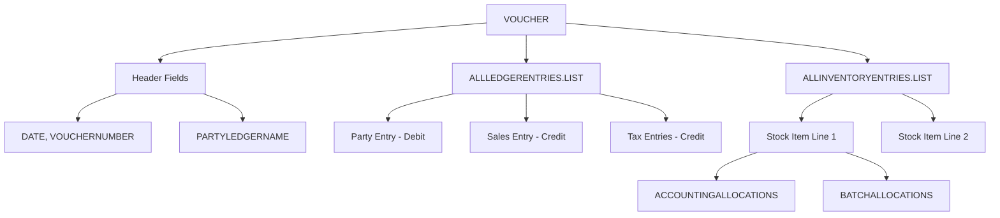

Everything up to now has been about *reading* from Tally. Import/Data flips the direction — this is how you *write* data into Tally. Create ledgers, push sales orders, update stock items. If your integration needs to put data into Tally, this is the request type you need.

## When to Use Import/Data

- **Creating masters** — new ledgers (party accounts), stock items, godowns
- **Creating vouchers** — sales orders, purchase orders, invoices
- **Updating existing objects** — change a ledger address, alter a voucher
- **Any write operation** to Tally's database

## The Basic Shape

```xml
<ENVELOPE>
  <HEADER>
    <VERSION>1</VERSION>
    <TALLYREQUEST>Import</TALLYREQUEST>
    <TYPE>Data</TYPE>
    <ID>All Masters</ID>
  </HEADER>
  <BODY>
    <DESC>
      <STATICVARIABLES>
        <SVCURRENTCOMPANY>
          Stockist Pharma Pvt Ltd
        </SVCURRENTCOMPANY>
      </STATICVARIABLES>
    </DESC>
    <DATA>
      <TALLYMESSAGE
        xmlns:UDF="TallyUDF">
        <!-- objects go here -->
      </TALLYMESSAGE>
    </DATA>
  </BODY>
</ENVELOPE>
```

Key differences from export requests:

- `TALLYREQUEST` is `Import` instead of `Export`
- `ID` is either `All Masters` or `Vouchers`
- There is a `DATA` section containing a `TALLYMESSAGE` wrapper
- Objects inside `TALLYMESSAGE` have an `ACTION` attribute

## The ID Field: Masters vs Vouchers

| ID Value | What You Can Push |
|----------|------------------|
| `All Masters` | Ledgers, stock items, stock groups, godowns, units, voucher types |
| `Vouchers` | Sales orders, purchase orders, invoices, receipts, payments |

:::caution
Do not mix masters and vouchers in the same request. Use `All Masters` for master data and `Vouchers` for transaction data. Send them as separate HTTP calls.
:::

## The TALLYMESSAGE Wrapper

Every object you want to create or update lives inside `TALLYMESSAGE`:

```xml
<DATA>
  <TALLYMESSAGE xmlns:UDF="TallyUDF">
    <LEDGER NAME="New Shop"
      ACTION="Create">
      <PARENT>Sundry Debtors</PARENT>
      <!-- fields -->
    </LEDGER>
  </TALLYMESSAGE>
</DATA>
```

The `xmlns:UDF="TallyUDF"` namespace declaration is needed if any User Defined Fields (UDFs) are present. Include it by default — it does no harm even when there are no UDFs.

## The ACTION Attribute

Every object needs an `ACTION` to tell Tally what to do:

| ACTION | What It Does | Use Case |
|--------|-------------|----------|
| `Create` | Create a new object | New ledger, new order |
| `Alter` | Update an existing object | Change address, modify order |
| `Delete` | Remove an object | Delete a voucher |
| `Cancel` | Cancel (but keep record) | Cancel an order |

For `Alter`, `Delete`, and `Cancel`, you need to identify the existing object. Use one of:

- `MASTERID` — Tally's internal ID (most reliable)
- `GUID` — Globally unique identifier
- Voucher Number + Type + Date combination

## Creating Masters

### Example: Create a Party Ledger

When a sales rep visits a new medical shop, the party ledger may not exist in Tally yet. Create it first:

```xml
<ENVELOPE>
  <HEADER>
    <VERSION>1</VERSION>
    <TALLYREQUEST>Import</TALLYREQUEST>
    <TYPE>Data</TYPE>
    <ID>All Masters</ID>
  </HEADER>
  <BODY>
    <DESC>
      <STATICVARIABLES>
        <SVCURRENTCOMPANY>
          Stockist Pharma Pvt Ltd
        </SVCURRENTCOMPANY>
      </STATICVARIABLES>
    </DESC>
    <DATA>
      <TALLYMESSAGE
        xmlns:UDF="TallyUDF">
        <LEDGER NAME="Raj Medical - Surat"
          ACTION="Create">
          <PARENT>Sundry Debtors</PARENT>
          <ISBILLWISEON>Yes</ISBILLWISEON>
          <AFFECTSSTOCK>No</AFFECTSSTOCK>
          <ISREVENUE>No</ISREVENUE>
          <ADDRESS.LIST TYPE="String">
            <ADDRESS>123 Main Road</ADDRESS>
            <ADDRESS>
              Surat, Gujarat 395001
            </ADDRESS>
          </ADDRESS.LIST>
          <LEDGERPHONE>
            +91-9876543210
          </LEDGERPHONE>
          <LEDSTATENAME>Gujarat</LEDSTATENAME>
          <PARTYGSTIN>
            24ABCDE1234F1Z5
          </PARTYGSTIN>
          <GSTREGISTRATIONTYPE>
            Regular
          </GSTREGISTRATIONTYPE>
        </LEDGER>
      </TALLYMESSAGE>
    </DATA>
  </BODY>
</ENVELOPE>
```

:::tip
Always set `PARENT` to `Sundry Debtors` for customers and `Sundry Creditors` for suppliers. Tally uses the group hierarchy to determine how the ledger behaves in transactions.
:::

## Creating Vouchers

### Example: Push a Sales Order

This is the big one — pushing a field sales order into Tally so the warehouse can see it and start fulfilling.

```xml
<ENVELOPE>
  <HEADER>
    <VERSION>1</VERSION>
    <TALLYREQUEST>Import</TALLYREQUEST>
    <TYPE>Data</TYPE>
    <ID>Vouchers</ID>
  </HEADER>
  <BODY>
    <DESC>
      <STATICVARIABLES>
        <SVCURRENTCOMPANY>
          Stockist Pharma Pvt Ltd
        </SVCURRENTCOMPANY>
      </STATICVARIABLES>
    </DESC>
    <DATA>
      <TALLYMESSAGE
        xmlns:UDF="TallyUDF">
        <VOUCHER VCHTYPE="Sales Order"
          ACTION="Create"
          OBJVIEW="Invoice Voucher View">
          <DATE>20260325</DATE>
          <VOUCHERTYPENAME>
            Sales Order
          </VOUCHERTYPENAME>
          <VOUCHERNUMBER>
            SO/FIELD/0042
          </VOUCHERNUMBER>
          <PARTYLEDGERNAME>
            Raj Medical - Surat
          </PARTYLEDGERNAME>
          <PERSISTEDVIEW>
            Invoice Voucher View
          </PERSISTEDVIEW>
          <NARRATION>
            Field order by Amit K.
          </NARRATION>

          <!-- Party ledger entry -->
          <ALLLEDGERENTRIES.LIST>
            <LEDGERNAME>
              Raj Medical - Surat
            </LEDGERNAME>
            <ISDEEMEDPOSITIVE>
              Yes
            </ISDEEMEDPOSITIVE>
            <AMOUNT>-5000.00</AMOUNT>
          </ALLLEDGERENTRIES.LIST>

          <!-- Sales account entry -->
          <ALLLEDGERENTRIES.LIST>
            <LEDGERNAME>
              Sales Account
            </LEDGERNAME>
            <ISDEEMEDPOSITIVE>
              No
            </ISDEEMEDPOSITIVE>
            <AMOUNT>5000.00</AMOUNT>
          </ALLLEDGERENTRIES.LIST>

          <!-- Inventory line -->
          <ALLINVENTORYENTRIES.LIST>
            <STOCKITEMNAME>
              Paracetamol 500mg Strip/10
            </STOCKITEMNAME>
            <ISDEEMEDPOSITIVE>
              No
            </ISDEEMEDPOSITIVE>
            <RATE>50.00/Strip</RATE>
            <ACTUALQTY>100 Strip</ACTUALQTY>
            <BILLEDQTY>100 Strip</BILLEDQTY>
            <AMOUNT>5000.00</AMOUNT>
            <ACCOUNTINGALLOCATIONS.LIST>
              <LEDGERNAME>
                Sales Account
              </LEDGERNAME>
              <AMOUNT>5000.00</AMOUNT>
            </ACCOUNTINGALLOCATIONS.LIST>
            <BATCHALLOCATIONS.LIST>
              <GODOWNNAME>
                Main Location
              </GODOWNNAME>
              <BATCHNAME>
                Primary Batch
              </BATCHNAME>
              <ORDERDUEDATE>
                20260401
              </ORDERDUEDATE>
              <AMOUNT>5000.00</AMOUNT>
              <ACTUALQTY>
                100 Strip
              </ACTUALQTY>
              <BILLEDQTY>
                100 Strip
              </BILLEDQTY>
            </BATCHALLOCATIONS.LIST>
          </ALLINVENTORYENTRIES.LIST>

        </VOUCHER>
      </TALLYMESSAGE>
    </DATA>
  </BODY>
</ENVELOPE>
```

### The Voucher Anatomy

Here is how the pieces fit together:



**Critical rule**: The sum of all `ALLLEDGERENTRIES.LIST` amounts must be zero. Debit amounts are negative, credit amounts are positive. If the totals do not balance, Tally rejects the voucher with "Voucher totals do not match!"

## The Response Format

After a successful import, Tally responds with a status summary:

```xml
<RESPONSE>
  <CREATED>1</CREATED>
  <ALTERED>0</ALTERED>
  <LASTVCHID>12345</LASTVCHID>
  <LASTMASTERID>67890</LASTMASTERID>
  <COMBINED>0</COMBINED>
  <IGNORED>0</IGNORED>
  <ERRORS>0</ERRORS>
  <LINEERROR></LINEERROR>
</RESPONSE>
```

| Field | Meaning |
|-------|---------|
| `CREATED` | Number of objects created |
| `ALTERED` | Number of objects updated |
| `LASTVCHID` | ID of last voucher created |
| `LASTMASTERID` | ID of last master created |
| `COMBINED` | Objects merged with existing |
| `ERRORS` | Number of failures |
| `LINEERROR` | Detailed error messages |

:::tip
Always store `LASTVCHID` and `LASTMASTERID` from the response. You will need these to alter or delete the object later.
:::

## Error Handling

When things go wrong, Tally puts details in the `LINEERROR` field. Here are the errors you will see most often:

| Error Message | Cause | Fix |
|--------------|-------|-----|
| `Voucher totals do not match!` | Dr/Cr sides do not balance | Check your amount math, especially GST |
| `[STOCKITEM] not found` | Item name does not match any master | Pre-validate against cached stock items |
| `[LEDGER] not found` | Party ledger missing | Create the ledger first, then retry |
| `Unknown Request` | XML malformed or too many objects | Split into smaller batches |

:::danger
Tally is **case-sensitive on names**. `Paracetamol 500mg Strip/10` and `paracetamol 500mg strip/10` are different items. Always use the exact name from your cached master data.
:::

## Pre-Validation Checklist

Before pushing any voucher, verify these against your local cache:

1. **Party ledger exists** — if not, auto-create it first
2. **Stock item names match exactly** — case-sensitive comparison
3. **Godown exists** — if multi-godown is enabled
4. **Sales ledger exists** — `Sales Account` or whatever the stockist uses
5. **GST ledgers exist** — `Output IGST 18%`, `Output CGST 9%`, etc.
6. **Dr/Cr totals balance** — party amount = sum of item amounts + tax amounts

## Voucher Lifecycle Operations

Creating is just the beginning. Here is the full lifecycle:

| Operation | ACTION | How to Identify |
|-----------|--------|----------------|
| Create | `Create` | N/A — it is new |
| Update | `Alter` | MasterID or GUID |
| Cancel | `Cancel` | MasterID or GUID |
| Delete | `Delete` | MasterID or GUID |

For Alter, Cancel, and Delete, include identifying tags:

```xml
<VOUCHER VCHTYPE="Sales Order"
  ACTION="Alter">
  <MASTERID>12345</MASTERID>
  <!-- updated fields -->
</VOUCHER>
```

## What is Next

Import/Data covers most write scenarios. For the rare case where you need to trigger an internal Tally action, see [Execute/TDLAction](/tally-integartion/xml-protocol/execute-action/).
