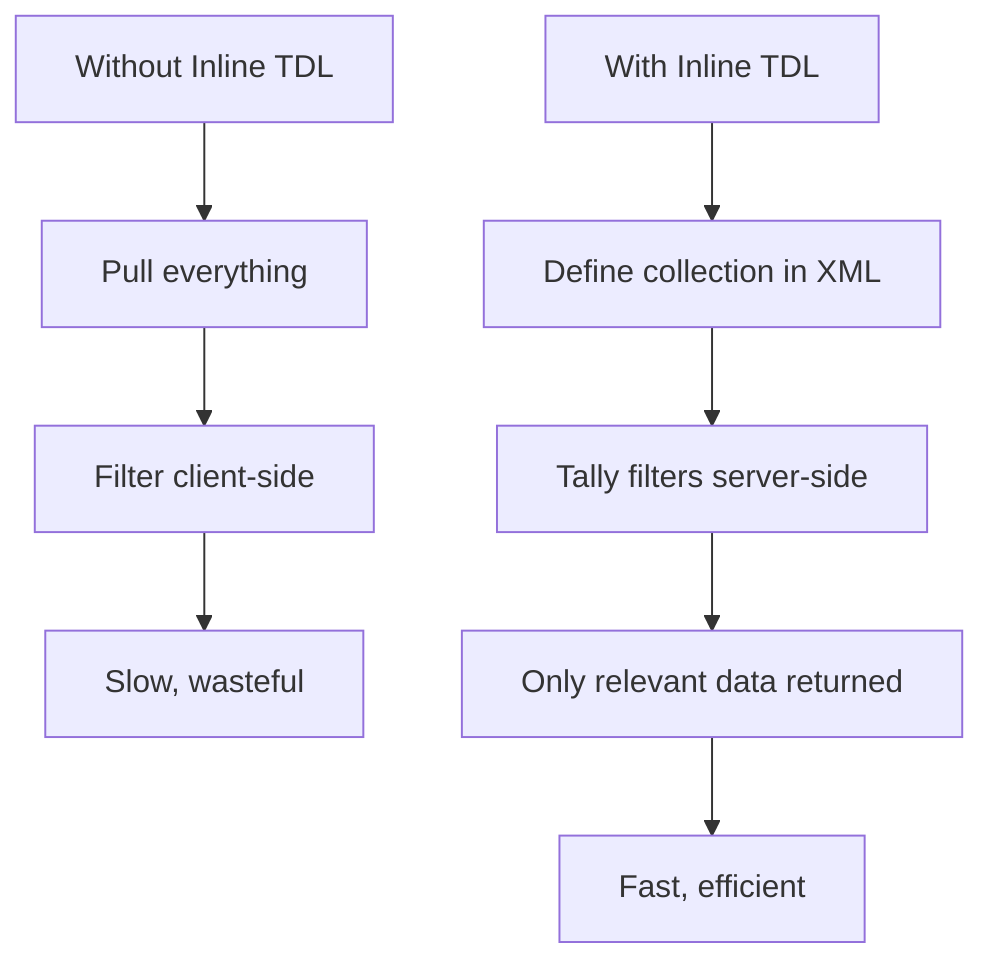
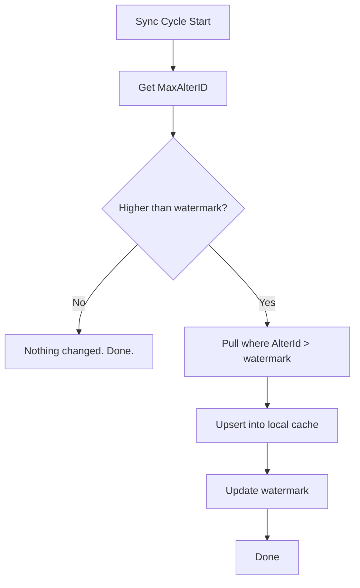

This is the feature that separates basic Tally integrations from powerful ones.

With inline TDL, you embed collection definitions, field selections, filters, and even computed fields *directly inside your XML request*. No TDL file installation on the stockist's machine. No asking anyone to load a plugin. Your connector sends the TDL definition with every request, and Tally executes it on the spot.

## Why This Changes Everything

Without inline TDL, you are limited to Tally's built-in collections and reports. You get *everything* back — every field, every object — and filter client-side.

With inline TDL, you control:

- **Exactly which fields** come back (reduce payload by 90%)
- **Server-side filters** (only changed objects, only specific types)
- **Computed fields** (TDL expressions evaluated by Tally)
- **Custom collections** (combine data from multiple object types)

And the best part? It all happens inside the XML request. Zero footprint on the stockist's machine.



## The TDLMESSAGE Section

Inline TDL lives in the `TDL > TDLMESSAGE` block inside the `DESC` section:

```xml
<BODY>
  <DESC>
    <STATICVARIABLES>
      <!-- company targeting -->
    </STATICVARIABLES>
    <TDL>
      <TDLMESSAGE>
        <!-- your TDL definitions here -->
      </TDLMESSAGE>
    </TDL>
  </DESC>
</BODY>
```

Inside `TDLMESSAGE`, you can define:

- `COLLECTION` — what objects to pull and how
- `SYSTEM` — filter formulas and computed values
- `FIELD` — custom field definitions
- `PART` / `LINE` — report layout (rarely needed)

## Defining Collections

A collection definition tells Tally: "give me objects of this type, with these fields, matching these filters."

```xml
<COLLECTION NAME="MyStockExport"
  ISMODIFY="No">
  <TYPE>StockItem</TYPE>
  <NATIVEMETHOD>
    Name, Parent, BaseUnits
  </NATIVEMETHOD>
  <NATIVEMETHOD>
    GUID, MasterId, AlterId
  </NATIVEMETHOD>
</COLLECTION>
```

The `NAME` must match the `ID` in your request header. `ISMODIFY="No"` marks it read-only.

## FETCH vs NATIVEMETHOD

Both control which fields appear in the response, but they work differently:

| Attribute | What It Does | Best For |
|-----------|-------------|----------|
| `FETCH` | Fetches fields, resolves sub-objects and lists | Complex nested data like `GSTDetails.List` |
| `NATIVEMETHOD` | Fetches native object properties | Simple flat fields |

You can use multiple `NATIVEMETHOD` lines (or `FETCH` lines) to keep things readable:

```xml
<COLLECTION NAME="StockExport"
  ISMODIFY="No">
  <TYPE>StockItem</TYPE>

  <!-- Identity fields -->
  <NATIVEMETHOD>
    Name, Parent, GUID
  </NATIVEMETHOD>
  <NATIVEMETHOD>
    MasterId, AlterId
  </NATIVEMETHOD>

  <!-- Inventory fields -->
  <NATIVEMETHOD>
    BaseUnits, Category
  </NATIVEMETHOD>
  <NATIVEMETHOD>
    OpeningBalance, ClosingBalance
  </NATIVEMETHOD>
  <NATIVEMETHOD>
    OpeningValue, ClosingValue
  </NATIVEMETHOD>

  <!-- Business fields -->
  <NATIVEMETHOD>
    StandardCost, StandardSellingPrice
  </NATIVEMETHOD>
  <NATIVEMETHOD>
    ReorderLevel, MinimumOrderQuantity
  </NATIVEMETHOD>

  <!-- Feature flags -->
  <NATIVEMETHOD>
    HasMfgDate, MaintainInBatches
  </NATIVEMETHOD>

  <!-- Nested lists (use FETCH) -->
  <FETCH>GSTDetails.List</FETCH>
  <FETCH>BatchAllocations.List</FETCH>
</COLLECTION>
```

:::tip
Use `NATIVEMETHOD` for flat fields and `FETCH` for nested `.List` fields. Mixing both in the same collection works perfectly.
:::

## Server-Side Filters

Filters are where inline TDL really earns its keep. Instead of pulling 10,000 stock items and filtering in your code, tell Tally to only send the ones you care about.

### Filter Structure

A filter has two parts:

1. A `FILTER` attribute on the collection
2. A `SYSTEM` element defining the filter logic

```xml
<TDLMESSAGE>
  <COLLECTION NAME="DebtorLedgers"
    ISMODIFY="No">
    <TYPE>Ledger</TYPE>
    <NATIVEMETHOD>
      Name, Parent, GUID, AlterId
    </NATIVEMETHOD>
    <FILTER>IsDebtor</FILTER>
  </COLLECTION>

  <SYSTEM TYPE="Formulae"
    NAME="IsDebtor">
    $Parent = "Sundry Debtors"
  </SYSTEM>
</TDLMESSAGE>
```

The `FILTER` value references the `NAME` of the `SYSTEM` element. Tally evaluates the formula for each object and only returns matches.

### Multiple Filters

You can chain filters — all must be true (AND logic):

```xml
<COLLECTION NAME="FilteredItems"
  ISMODIFY="No">
  <TYPE>StockItem</TYPE>
  <NATIVEMETHOD>Name, AlterId</NATIVEMETHOD>
  <FILTER>RecentlyChanged</FILTER>
  <FILTER>InCategory</FILTER>
</COLLECTION>

<SYSTEM TYPE="Formulae"
  NAME="RecentlyChanged">
  $$FilterGreater:$AlterId:5000
</SYSTEM>

<SYSTEM TYPE="Formulae"
  NAME="InCategory">
  $Category = "Analgesics"
</SYSTEM>
```

## Filter by AlterID — Incremental Sync

This is the most important filter pattern. It powers efficient incremental sync by only pulling objects that changed since your last sync.

```xml
<TDLMESSAGE>
  <COLLECTION NAME="ChangedStock"
    ISMODIFY="No">
    <TYPE>StockItem</TYPE>
    <NATIVEMETHOD>
      Name, Parent, BaseUnits,
      GUID, MasterId, AlterId,
      OpeningBalance, ClosingBalance,
      StandardCost,
      StandardSellingPrice
    </NATIVEMETHOD>
    <FILTER>ModifiedSince</FILTER>
  </COLLECTION>

  <SYSTEM TYPE="Formulae"
    NAME="ModifiedSince">
    $$FilterGreater:$AlterId:5000
  </SYSTEM>
</TDLMESSAGE>
```

Replace `5000` with your stored watermark. On each sync cycle:

1. Call `$$MaxMasterAlterID` to check if anything changed
2. If yes, pull objects where `AlterId > watermark`
3. Update your watermark to the new max



:::caution
AlterID-based incremental sync catches creates and updates, but **not deletes**. A deleted object simply stops appearing. To detect deletions, periodically do a full ID reconciliation — pull all GUIDs and compare against your cache.
:::

## Full Worked Example

Here is a complete, production-ready request that pulls all stock items with specific fields and an AlterID filter:

```xml
<ENVELOPE>
  <HEADER>
    <VERSION>1</VERSION>
    <TALLYREQUEST>Export</TALLYREQUEST>
    <TYPE>Collection</TYPE>
    <ID>IncrementalStockSync</ID>
  </HEADER>
  <BODY>
    <DESC>
      <STATICVARIABLES>
        <SVCURRENTCOMPANY>
          Stockist Pharma Pvt Ltd
        </SVCURRENTCOMPANY>
        <SVEXPORTFORMAT>
          $$SysName:XML
        </SVEXPORTFORMAT>
      </STATICVARIABLES>
      <TDL>
        <TDLMESSAGE>
          <COLLECTION
            NAME="IncrementalStockSync"
            ISMODIFY="No">
            <TYPE>StockItem</TYPE>

            <NATIVEMETHOD>
              Name, Alias, PartNumber
            </NATIVEMETHOD>
            <NATIVEMETHOD>
              Parent, Category, BaseUnits
            </NATIVEMETHOD>
            <NATIVEMETHOD>
              GUID, MasterId, AlterId
            </NATIVEMETHOD>
            <NATIVEMETHOD>
              OpeningBalance, OpeningValue
            </NATIVEMETHOD>
            <NATIVEMETHOD>
              ClosingBalance, ClosingValue
            </NATIVEMETHOD>
            <NATIVEMETHOD>
              StandardCost,
              StandardSellingPrice
            </NATIVEMETHOD>
            <NATIVEMETHOD>
              ReorderLevel,
              MinimumOrderQuantity
            </NATIVEMETHOD>
            <NATIVEMETHOD>
              HasMfgDate,
              MaintainInBatches
            </NATIVEMETHOD>
            <NATIVEMETHOD>
              Description, Narration
            </NATIVEMETHOD>

            <FETCH>GSTDetails.List</FETCH>

            <FILTER>
              ModifiedSinceLastSync
            </FILTER>
          </COLLECTION>

          <SYSTEM TYPE="Formulae"
            NAME="ModifiedSinceLastSync">
            $$FilterGreater:$AlterId:5000
          </SYSTEM>
        </TDLMESSAGE>
      </TDL>
    </DESC>
  </BODY>
</ENVELOPE>
```

### What Comes Back

```xml
<ENVELOPE>
  <COLLECTION>
    <STOCKITEM NAME="New Item Added">
      <NAME>New Item Added</NAME>
      <PARENT>Analgesics</PARENT>
      <BASEUNITS>Strip</BASEUNITS>
      <GUID>xyz-789</GUID>
      <MASTERID>99</MASTERID>
      <ALTERID>5042</ALTERID>
      <!-- ...only the fields you asked for -->
      <GSTDETAILS.LIST>
        <APPLICABLEFROM>
          20240401
        </APPLICABLEFROM>
        <HSNCODE>30049099</HSNCODE>
        <TAXABILITY>Taxable</TAXABILITY>
      </GSTDETAILS.LIST>
    </STOCKITEM>
  </COLLECTION>
</ENVELOPE>
```

Only items with `AlterId > 5000` are returned. Only the fields you specified are included. The response is compact and exactly what you need.

## Discovering Available Collections

Want to know what collections are available in a Tally instance? Use inline TDL to query the meta-collection:

```xml
<ENVELOPE>
  <HEADER>
    <VERSION>1</VERSION>
    <TALLYREQUEST>Export</TALLYREQUEST>
    <TYPE>Collection</TYPE>
    <ID>ListOfCollections</ID>
  </HEADER>
  <BODY>
    <DESC>
      <TDL>
        <TDLMESSAGE>
          <COLLECTION
            NAME="ListOfCollections"
            ISMODIFY="No">
            <TYPE>Collection</TYPE>
            <FETCH>Name</FETCH>
          </COLLECTION>
        </TDLMESSAGE>
      </TDL>
    </DESC>
  </BODY>
</ENVELOPE>
```

This is useful during onboarding to discover what custom collections a TDL plugin may have added.

## Handling UDFs in Inline TDL

If you know the names of User Defined Fields, you can FETCH them explicitly:

```xml
<COLLECTION NAME="StockWithUDFs"
  ISMODIFY="No">
  <TYPE>StockItem</TYPE>
  <NATIVEMETHOD>
    Name, GUID, AlterId
  </NATIVEMETHOD>
  <!-- UDF by name (if TDL loaded) -->
  <FETCH>DrugSchedule</FETCH>
  <FETCH>StorageTemperature</FETCH>
</COLLECTION>
```

If the TDL defining those UDFs is not loaded, the named fields simply will not appear in the response. Your parser should handle missing fields gracefully.

## Performance Considerations

Inline TDL has a few things to keep in mind:

| Concern | Guideline |
|---------|-----------|
| Collection size | Cap at ~5,000 objects per request |
| Field count | Fewer fields = faster response |
| Filter complexity | Simple filters are fast; avoid deep nesting |
| Nested lists | `GSTDetails.List` adds overhead per item |

:::tip
For large datasets, combine inline TDL filters with date-range batching. Filter by AlterID *and* batch by date range for vouchers. This keeps each request small and fast.
:::

## What is Next

You have the power of inline TDL. Now learn how to use it responsibly at scale — see [Batching Rules](/tally-integartion/xml-protocol/batching-rules/) for the limits and strategies that keep Tally happy when you are pulling or pushing large volumes of data.
