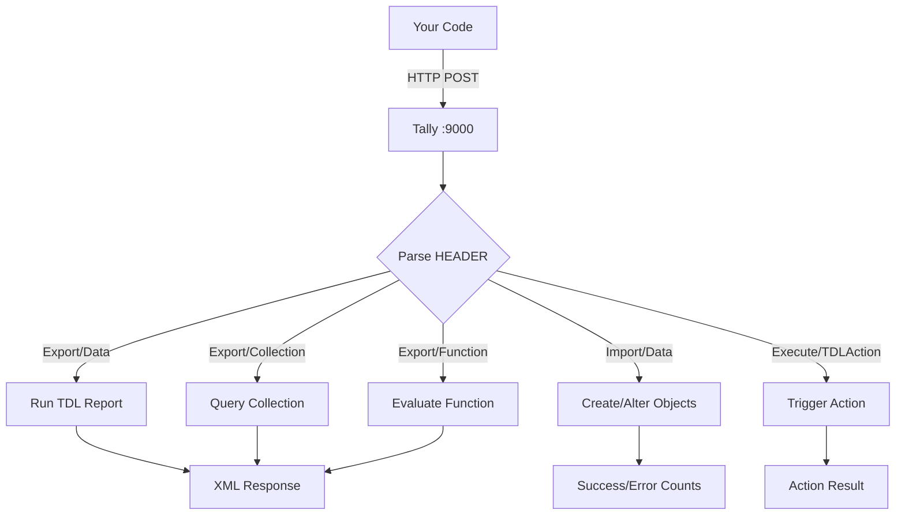
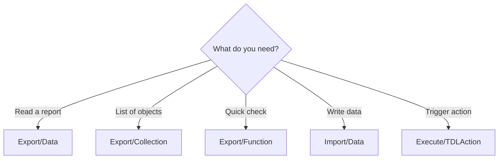

Every conversation with Tally starts the same way: you POST an XML envelope to `http://localhost:9000`. What changes is the *type* of request hiding inside that envelope.

There are exactly **five request types**. Master them, and you can do anything Tally can do — pull data, push data, and trigger actions.

## The Envelope Structure

Every request follows the same skeleton: an `ENVELOPE` wrapping a `HEADER` and a `BODY`.

```xml
<ENVELOPE>
  <HEADER>
    <VERSION>1</VERSION>
    <TALLYREQUEST>Export</TALLYREQUEST>
    <TYPE>Data</TYPE>
    <ID>Stock Summary</ID>
  </HEADER>
  <BODY>
    <DESC>
      <STATICVARIABLES>
        <!-- targeting & config -->
      </STATICVARIABLES>
    </DESC>
    <!-- DATA section for imports -->
  </BODY>
</ENVELOPE>
```

The `HEADER` tells Tally *what kind* of request this is. The `BODY` provides parameters, filters, and (for imports) the actual data payload.

## Request Flow

Here is how a request travels from your code to Tally and back:



## The Five Request Types

| Type | HEADER Config | What It Does | When to Use |
|------|--------------|--------------|-------------|
| **Export/Data** | `TALLYREQUEST=Export` `TYPE=Data` | Pull a built-in TDL report | Daybook, Stock Summary, Trial Balance |
| **Export/Collection** | `TALLYREQUEST=Export` `TYPE=Collection` | Pull a list of objects | All stock items, all ledgers, filtered sets |
| **Export/Function** | `TALLYREQUEST=Export` `TYPE=Function` | Evaluate a TDL function | Heartbeat checks, change detection |
| **Import/Data** | `TALLYREQUEST=Import` `TYPE=Data` | Push masters or vouchers into Tally | Creating orders, ledgers, stock items |
| **Execute/TDLAction** | `TALLYREQUEST=Execute` `TYPE=TDLAction` | Trigger an internal action | Rare — sync triggers, custom actions |

Let's walk through each one.

---

### 1. Export/Data — Pull Reports

This is your go-to for pulling **pre-built reports** out of Tally. Think of it as asking Tally to run a report and hand you the result as XML.

```xml
<HEADER>
  <VERSION>1</VERSION>
  <TALLYREQUEST>Export</TALLYREQUEST>
  <TYPE>Data</TYPE>
  <ID>Stock Summary</ID>
</HEADER>
```

The `ID` field is the report name. Common ones include `Daybook`, `Stock Summary`, `Trial Balance`, and `List of Companies`.

:::tip
Export/Data is perfect when you want Tally's *computed* view of things — stock positions, balances, summaries. Tally does the math; you get the result.
:::

### 2. Export/Collection — Pull Object Lists

When you want raw objects — every stock item, every ledger, every voucher matching a filter — this is your workhorse.

```xml
<HEADER>
  <VERSION>1</VERSION>
  <TALLYREQUEST>Export</TALLYREQUEST>
  <TYPE>Collection</TYPE>
  <ID>MyStockItems</ID>
</HEADER>
```

The `ID` here refers to a **collection name** — either a built-in one or one you define inline using TDL. The real power comes from inline TDL, where you control exactly which fields come back and how they are filtered.

### 3. Export/Function — Evaluate TDL Functions

Need a quick answer from Tally? Functions let you evaluate a TDL expression and get a single result back.

```xml
<HEADER>
  <VERSION>1</VERSION>
  <TALLYREQUEST>Export</TALLYREQUEST>
  <TYPE>Function</TYPE>
  <ID>$$CmpLoaded</ID>
</HEADER>
```

Great for heartbeat checks (`$$CmpLoaded`) and change detection (`$$MaxMasterAlterID`, `$$MaxVoucherAlterID`).

### 4. Import/Data — Push Data Into Tally

This is your write path. Create ledgers, push sales orders, update stock items — all through Import requests.

```xml
<HEADER>
  <VERSION>1</VERSION>
  <TALLYREQUEST>Import</TALLYREQUEST>
  <TYPE>Data</TYPE>
  <ID>Vouchers</ID>
</HEADER>
```

The `ID` is either `All Masters` (for master data) or `Vouchers` (for transactions). The `BODY` contains a `DATA` section with the actual objects wrapped in `TALLYMESSAGE`.

:::caution
Import is the only request type that *modifies* data in Tally. Double-check your XML before sending — there is no "undo" button.
:::

### 5. Execute/TDLAction — Trigger Actions

The least common type. Use it to trigger TDL-defined actions inside Tally — things like sync triggers or custom automation.

```xml
<HEADER>
  <VERSION>1</VERSION>
  <TALLYREQUEST>Execute</TALLYREQUEST>
  <TYPE>TDLAction</TYPE>
  <ID>SomeAction</ID>
</HEADER>
```

Most integrations never need this. If you are doing standard data sync, you can safely ignore it until you have a specific need.

## Choosing the Right Type

Here is a quick decision tree:



**In practice**, you will use Export/Collection (with inline TDL) for most reads and Import/Data for all writes. Export/Data is handy for computed reports like Stock Summary. Export/Function is your lightweight health-check tool.

## Targeting a Company

Regardless of request type, you almost always need to tell Tally *which company* you are talking to. You do this in `STATICVARIABLES`:

```xml
<STATICVARIABLES>
  <SVCURRENTCOMPANY>
    My Company Name
  </SVCURRENTCOMPANY>
  <SVEXPORTFORMAT>
    $$SysName:XML
  </SVEXPORTFORMAT>
</STATICVARIABLES>
```

:::tip
If only one company is loaded in Tally, you can sometimes omit `SVCURRENTCOMPANY`. But always include it for reliability — you never know when a stockist will load a second company.
:::

## What is Next

Now that you know the five request types, let's dig into each one. We will start with **Export/Data** for pulling reports, then move to **Export/Collection** for pulling object lists, and work our way through the rest.
